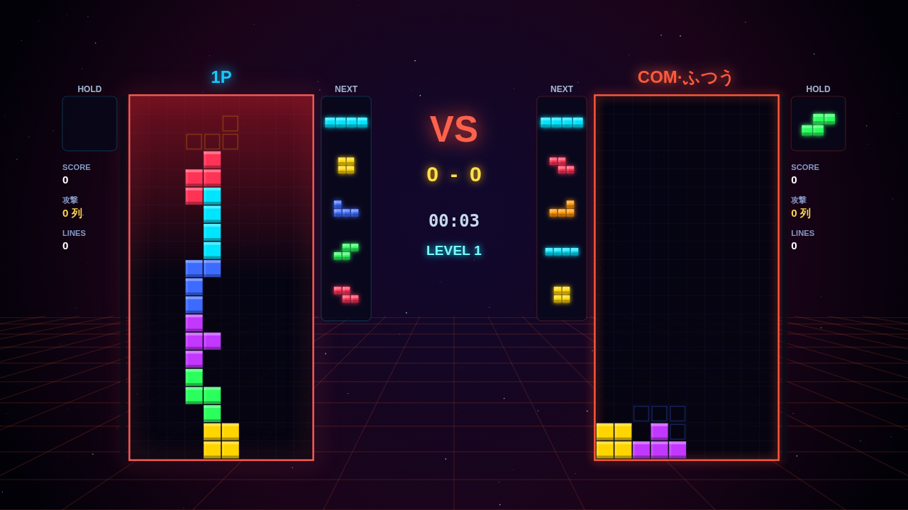
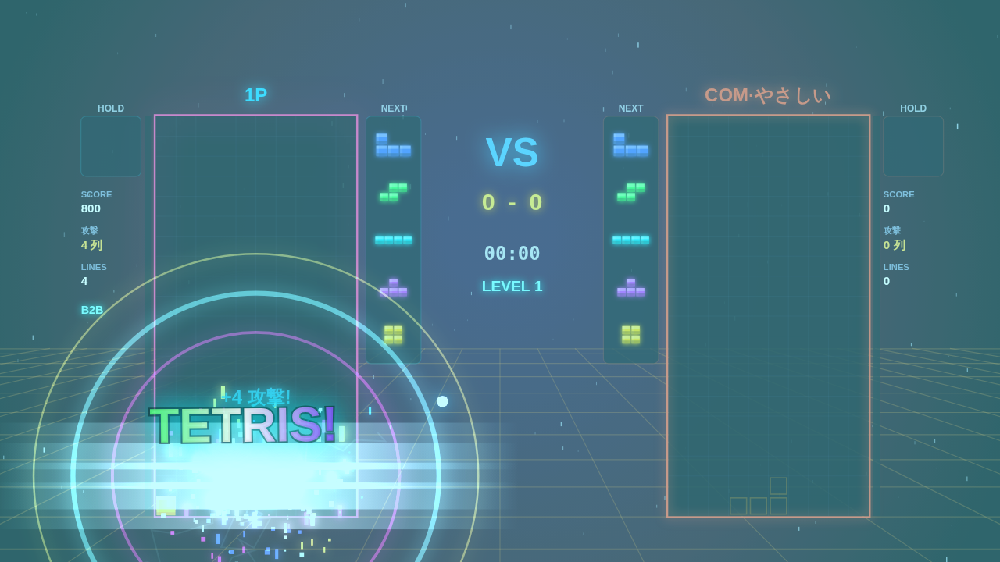

# NEON TETRIS BATTLE — 対戦テトリス

ブラウザで動く、派手なネオン演出の **2人対戦テトリス** です。依存ライブラリ・外部アセットは一切なし（HTML + CSS + 素のJavaScriptのみ）。グラフィックは Canvas、効果音とBGM（コロブチカ）はすべて Web Audio API でリアルタイム合成しています。



## 遊び方

`index.html` をブラウザで開くだけで遊べます。ローカルサーバーを使う場合は:

```bash
npx serve .
# または
python3 -m http.server 8000
```

GitHub Pages にそのままデプロイ可能です（ビルド不要）。

## モード

- **コンピューターと対戦** — COMの強さを4段階から選択
  - やさしい / ふつう / つよい / **鬼**（「つよい」以上は右端に井戸を掘ってテトリスを狙ってきます）
- **ふたりで対戦** — 1台のキーボード or ゲームパッド2台で対人戦
- タイトル画面の裏では COM 同士のデモ対戦が流れます

## 操作方法

| 操作 | 1P（キーボード） | 2P（キーボード） | ゲームパッド |
|---|---|---|---|
| 左右移動 | A / D | ← / → | 十字キー / 左スティック |
| ソフトドロップ | S | ↓ | 十字キー下 / スティック下 |
| ハードドロップ | W | ↑ | 十字キー上 |
| 右回転 | G | K / Enter | Ⓐ / Ⓑ |
| 左回転 | F | L | Ⓧ / Ⓨ |
| ホールド | 左Shift / Q | 右Shift / O | L / R |
| ポーズ | Esc / P | Esc / P | START |

ゲームパッドは **1台目が1P、2台目が2P** に自動割り当てされます（標準マッピング対応パッド）。メニューもキーボード・パッドどちらでも操作できます。

## 対戦ルール

- 相手より長く生き残ったら勝ち（トップアウトで KO）
- ライン消去で相手におじゃまラインを送る:
  - ダブル +1 / トリプル +2 / **テトリス +4**
  - Tスピン: シングル +2 / ダブル +4 / トリプル +6
  - **Back-to-Back** でさらに +1、**REN（コンボ）** で追加ボーナス
  - **パーフェクトクリア +10**
- 予告されたおじゃまは自分のライン消去で**相殺**できる
- 30秒ごとに落下速度がアップ（最大レベル12）
- 両者同じツモ順（同一シード7種バッグ）で公平

## 演出について

「テトリス（4列消し）」の瞬間は、ヒットストップ → 全画面フラッシュ → 横断ビーム → 三重衝撃波 → 稲妻 → 数百個のパーティクル → 画面シェイク → 虹色の `TETRIS!` バナー → 重低音と上昇アルペジオの爆発音が一斉に発動します。爽快感重視。



そのほか、Tスピン・パーフェクトクリア・KO（盤面が砕け散る）・ピンチ時の赤い警告と心音、ビートに同期して脈動する背景グリッドなどを実装しています。

## 技術メモ

- **SRS（スーパーローテーション）** 準拠の回転とウォールキック、7種1巡バッグ、ホールド、ゴースト、ロック遅延（リセット上限15回）、DAS/ARR
- **Web Audio API**: BGM はルックアヘッド型シーケンサで合成（戦闘曲はコロブチカ、ピンチで自動的にドラムが激しくなる）。効果音もすべてオシレータ＋ノイズの合成
- **Gamepad API**: 標準マッピング、接続順に自動割り当て
- **CPU**: 全配置を列挙して盤面評価（高さ・穴・凸凹・井戸維持）。難易度で思考速度／操作速度／ミス率／戦略が変化

## 開発・テスト

```bash
node test/sim.js        # ヘッドレスのロジック検証（コア + AI対戦シミュレーション）

# ブラウザ実機テスト（要 playwright）
node test/smoke.js      # 起動・操作・ポーズ
node test/flow.js       # KO → リザルト → 再戦 → タイトル
node test/tetris-fx.js  # テトリス演出と攻撃送信
```
